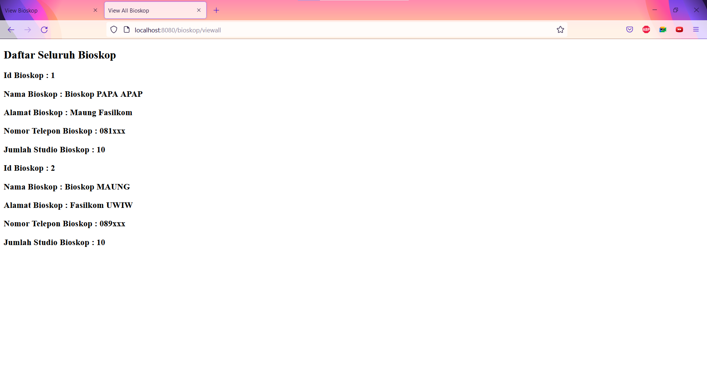

# Tutorial APAP

## Authors

* **Aisha Salsabila** - *1906399902* - *C*

---
## Tutorial 4
### Pertanyaan
1. Jelaskan perbedaan th:include dan th:replace!

   → Jika menggunakan th:include, fragment akan diletakkan di dalam tag yang melingkupi th:include tersebut. Sedangkan, apabila menggunakan th:replace, seluruh isi tag akan digantikan dengan fragment.

2. Jelaskan apa fungsi dari th:object!

   → th:object berfungsi untuk menjadikan atributnya sebagai object dari operasi-operasi di bawahnya. Sebagai contoh, dengan penulisan syntax th:object="${bioskop}", maka bioskop dapat digunakan sebagai object pada operasi selanjutnya hanya dengan menambahkan tanda bintang di depan atribut yang ingin digunakan.
   e.g. GCV

< span th :text=" $ {restoran.nama}"> mekdi< /span>.

3. Jelaskan perbedaan dari * dan $ pada saat penggunaan th:object! Kapan harus dipakai?

   → Sintax asterisk (*) mengevaluasi ekspresi pada objek yang dipilih dan bukan pada keseluruhan konteks. Sedangkan, syntax dollar ($) membutuhkan konteks yang utuh dari objek yang dipilih. Berikut contoh pemakaian pemakaian kedua syntax.
   
    

        
<b>Nama Bioskop</b> 

        
<b>Email:</b> 

    

   Titik (dot) pada ekspresi dengan syntax dollar digunakan untuk merujuk pada atribut/metode objek yang dipilih pada th:object. Pada ekspresi ${bioskop.noBioskop}, ekspresi tersebut mencoba menemukan objek model bioskop dan memanggil bioskop.getNoBioskop().

### What I did not understand
- [ ] Implementasi dynamic field pada thymeleaf

---
## Tutorial 3
### What I have learned today
### Pertanyaan
1. Tolong jelaskan secara singkat apa kegunaan dari anotasi-anotasi yang ada pada model 
   (@AllArgsConstructor, @NoArgsConstructor, @Setter, @Getter, @Entity, @Table)

   - @AllArgsConstructor → Meng-generate constructor untuk semua class field.
   - @NoArgsConstructor → Meng-generate constructor tanpa parameter.
   - @Setter → Secara otomatis Lombok akan generate default method setter untuk tiap atribut object.
   - @Getter → Secara otomatis Lombok akan menghasilkan default method getter untuk tiap atribut object.
   - @Entity → Mendefinisikan class sebagai class entity yang akan dipetakan sebagai table di database.
   - @Table → Digunakan untuk penamaan table/costum penamaan.

2. Pada class BioskopDB, terdapat method findByNoBioskop, apakah kegunaan dari method tersebut?

   → Mencari dan mengembalikan object Bioskop yang ada pada database BioskopDB berdasarkan nomor bioskopnya.

3. Jelaskan perbedaan kegunaan dari anotasi @JoinTable dan @JoinColumn

   Anotasi @JoinTable melakukan pengiriman id antar entitas ke table yang berbeda. Anotasi ini berfungsi untuk mengatur relasi antar entitas di tabel yang berbeda serta melakukan normalisasi database (meminimalisir redundansi).
   Sedangkan, anotasi @JoinColumn melakukan pengiriman id antar entitas di kolom yang baru pada table yang sama. Anotasi ini berguna untuk meningkatkan performa dan digunakan ketika terdapat hubungan langsung atau direct relationship seperti foreign key antar 2 entitas.

4. Pada class PenjagaModel, digunakan anotasi @JoinColumn pada atribut bioskop, apa kegunaan dari name, referencedColumnName, dan nullable dalam anotasi tersebut? dan apa perbedaan nullable dan penggunaan anotasi @NotNull
   
   Dalam anotasi @JoinColumn, name, referencedColumnName, dan nullable pada PenjagaModel digunakan sebagai:
   - name → Nama dari kolom foreign key. Pada atribut bioskop dalam class PenjagaModel, kolom foreign key nya bernama "no_bioskop".
   - referencedColumnName → Nama kolom yang dirujuk kolom foreign key. Pada konteks ini, kolom foreign key yang dirujuk merupakan artribut noBioskop dari BIOSKOP
   - nullable → Memberikan nilai boolean untuk suatu foreign key apakah bisa null atau tidak. Digunakan pada parameter atau return value yang dapat berupa null. Value nullable pada anotasi atribut bioskop adalah false sehingga menjadi constraint bahwa atribut bioskop tidak boleh null atau kosong, dimana berarti tiap penjaga pasti berada di suatu bioskop.
   
   Perbedaan nullable dan anotasi @NotNull menciptakan hasil atau memiliki fungsi yang serupa, namun terdapat 3 perbedaan utama di antara keduanya, yakni:
   - Spesifikasi yang mendefinisikan anotasi dan dependensi yang diperlukan.
     Anotasi @Column (dimana nullable adalah salah satu elemennya) merupakan bagian dari spesifikasi JPA dan dengan JPA, user sudah menggunakan semua dependensi yang diperlukan. Sedangkan, anotasi @NotNull ditentukan oleh spesifikasi BeanValidation dan user perlu menambahkan dependency ke proyek Hibernate Validator atau ke implementasi lain dari spesifikasi BeanValidation.
   - Sistem yang melakukan pengecekan
     Anotasi @NotNull memicu validasi oleh implementasi BeanValidation, dimana validasi terjadi di dalam aplikasi Java ketika pra-update atau pre-persist lifecycle event dipicu. Sedangkan, pada atribut yang diberikan anotasi @Column(nullable = false), Hibernate tidak melakukan validasi apa pun. Anotasi ini hanya menambahkan constraint bukan null ke kolom database jika Hibernate membuat definisi tabel database dan anotasi @Column(nullable = false) tidak berpengaruh jika bukan Hibernate yang mendefinisikan tabel.
   - Waktu ketika pemeriksaan dilakukan.
     Anotasi @NotNull memberi tahu implementasi BeanValidation untuk memeriksa apakah atributnya bukan null. Hal ini terjadi ketika peristiwa pra-update atau pre-persist lifecycle event diproses. Jika validasi gagal, Hibernate tidak akan mengeksekusi statement SQL apa pun. Sedangkan, anotasi @Column(nullable = false) hanya menambahkan batasan not null ke definisi tabel. Hibernate atau framework lainnya tidak akan melakukan validasi apa pun pada atribut entitas. Hibernate hanya mengeksekusi statement SQL UPDATE dan database akan memvalidasi constraint. Jika atribut entitas adalah null, statement SQL akan gagal.
   
   source: [Hibernate Tips: What’s the difference between @Column(nullable = false) and @NotNull](https://thorben-janssen.com/hibernate-tips-whats-the-difference-between-column-nullable-false-and-notnull/)

5. Jelaskan kegunaan FetchType.LAZY, CascadeType.ALL, dan FetchType.EAGER

   - FetchType.LAZY → Digunakan jika user ingin melakukan fetch ketika ia membutuhkan datanya. FetchType ini biasanya digunakan untuk relasi one-to-many atau many-to-many.
   - CascadeType.ALL → Digunakan jika user ingin data yang akan di-fetch sudah ada saat ia membutuhkannya sehingga ia melakukan fetch dari seawal mungkin. FetchType ini biasanya digunakan untuk relasi many-to-one atau one-to-one.
   - FetchType.EAGER → Digunakan agar semua perubahan yang terjadi pada suatu entitas terjadi juga pada entitas yang memiliki relasi dengannya (atribut foreign key). Perubahan ini dapat terjadi karena DELETE, UPDATE, dsb.

---
## Tutorial 2
### What I have learned today
### Pertanyaan
1. Cobalah untuk menambahkan sebuah Bioskop dengan mengakses link berikut: 
http://localhost:8080/bioskop/add?idBioskop=1&namaBioskop=Bioskop%20PAPA%20APAP&alamat=Maung%20Fasilkom&noTelepon=081xxx&jumlahStudio=10 
Apa yang terjadi? Jelaskan mengapa hal tersebut dapat terjadi

    Terjadi Whitelabel Error Page. Hal ini terjadi karena belum terdapat template yang dapat dirender.

2. Menurut kamu anotasi @Autowired pada class Controller tersebut merupakan implementasi dari konsep apa? Dan jelaskan secara singkat cara kerja
@Autowired tersebut dalam konteks service dan controller yang telah kamu buat.

    Anotasi @Autowired pada class Controller merupakan implementasi dari konsep Dependency Injection. Dengan anotasi @Autowired, developer tidak perlu lagi menyediakan setter method maupun menambahkan argumen di constructor untuk class-class dengan anotasi seperti @Service dan @Controller dari package yang telah dicari menggunakan fitur component-scan pada Spring Framework. Setelah ditemukan, maka anotasi @Autowired akan melakukan inisialisasi terhadap class tersebut, dan lalu mengisi (inject) semua kebutuhannya (dependency). Semua field/property yang memiliki anotasi @Autowired akan diisikan oleh Spring dengan object bertipe-data sesuai.

3. Cobalah untuk menambahkan sebuah Bioskop dengan mengakses link berikut:
http://localhost:8080/bioskop/add?idBioskop=1&namaBioskop=Bioskop%20PAPA%20APAP&alamat=Maung%20Fasilkom&noTelepon=081xxx 
Apa yang terjadi? Jelaskan mengapa hal tersebut dapat terjadi.

    Terjadi Whitelabel Error Page. Hal ini dikarenakan parameter request yang required dan diperlukan, yaitu parameter method 'jumlahStudio' dengan type int, tidak ada.

4. Jika Papa APAP ingin melihat Bioskop dengan nama Bioskop Maung, link apa yang harus diakses?

    http://localhost:8080/bioskop/view?idBioskop=2
    Dengan asumsi sudah dilakukan penambahan Bioskop MAUNG setelah bioskop PAPA APAP ditambahkan sehingga Bioskop MAUNG memiliki Id Bioskop: 2. Penambahan Bioskop MAUNG dilakukan dengan cara mengakses link berikut:
    http://localhost:8080/bioskop/add?idBioskop=2&namaBioskop=Bioskop%20MAUNG&alamat=Fasilkom%20UWIW&noTelepon=089xxx&jumlahStudio=10

5. Tambahkan 1 contoh Bioskop lainnya sesukamu. Lalu cobalah untuk mengakses http://localhost:8080/bioskop/viewall , apa yang akan ditampilkan? Sertakan
juga bukti screenshotmu.

    Setelah menambahkan bioskop lain, ketika mengakses link di atas akan muncul daftar seluruh bioskop yang telah didaftarkan beserta dengan detailnya, yaitu Bioskop PAPA APAP dan Bioskop MAUNG.
    

### What I did not understand
- [ ] Pemakaian GitHub secara maksimal
- [ ] Mana logic yang harus diselesaikan di Service dan mana yang di Controller

---
## Tutorial 1
### What I have learned today
### Github
1. Apa itu Issue Tracker? Apa saja masalah yang dapat diselesaikan dengan Issue Tracker?

Issue Tracker memungkinkan developer melacak pekerjaannya di GitHub dimana tempat pengembangan terjadi. Saat me-mention sebuah issue dalam issue lain atau pull request, timeline issue mencerminkan referensi silang (the cross-reference) sehingga kita dapat melacak pekerjaan terkait. Untuk menunjukkan bahwa pekerjaan sedang berlangsung, kita dapat menautkan (link) issue ke pull request. Saat pull request di-merge, issues yang tertaut secara otomatis ditutup.

GitHub Issue tracker dapat digunakan untuk meng-track ide-ide, feedback, task, ataupun bug untuk pekerjaan di GitHub.

2. Apa perbedaan dari git merge dan git merge --squash?

3. Apa keunggulan menggunakan Version Control System seperti Git dalam pengembangan suatu aplikasi?
### Spring
4. Apa itu library & dependency?

5. Apa itu Maven? Mengapa kita menggunakan Maven? Apakah ada alternatif dari Maven?

6. Selain untuk pengembangan web, apa saja yang bisa dikembangkan dengan Spring framework?

7. Apa perbedaan dari @RequestParam dan @PathVariable? Kapan sebaiknya
menggunakan @RequestParam atau @PathVariable?

### What I did not understand
- [ ] Kenapa saya harus belajar APAP?
- [ ] Pemakaian GitHub secara maksimal
- [ ] Penggunaan SpringBoot